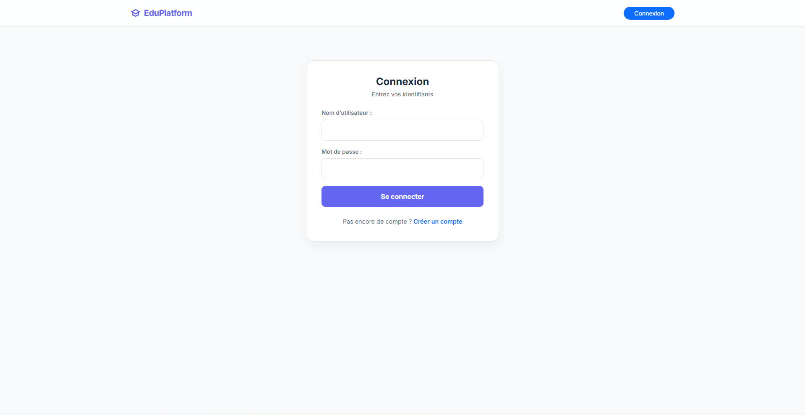
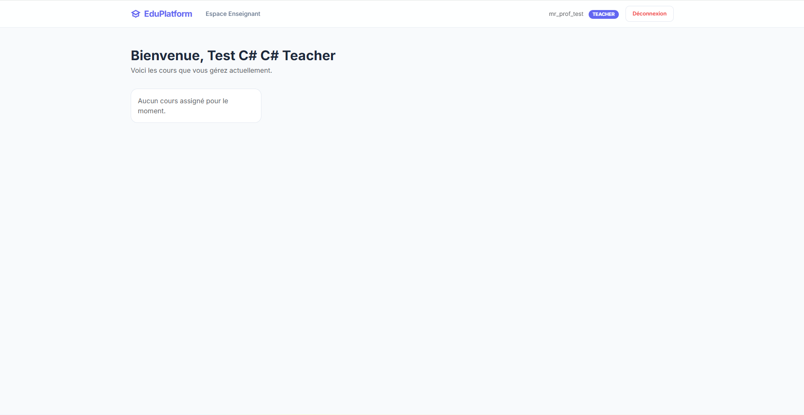
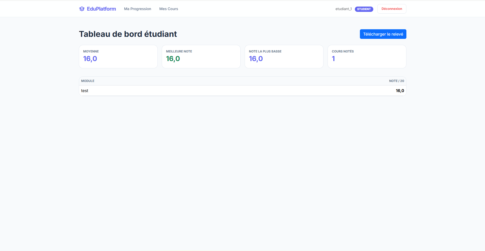
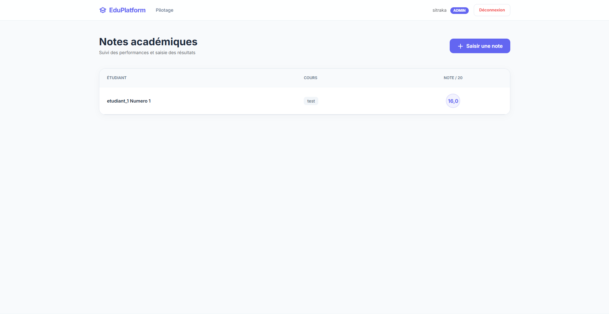
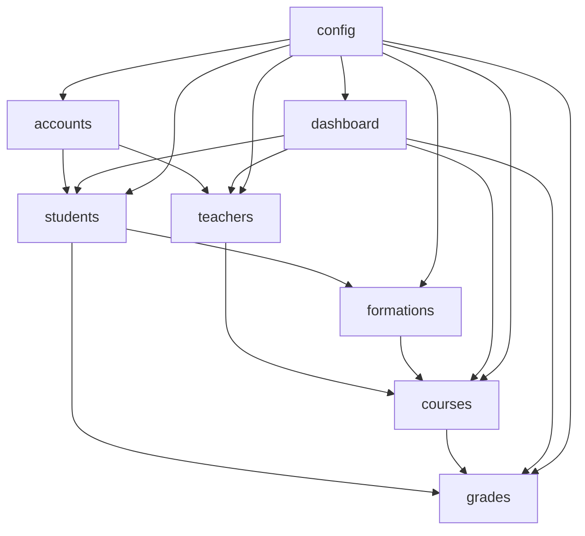

# University Management Platform

[](https://www.python.org/)
[](https://www.djangoproject.com/)
[](#tests)
[](#contributing)
[](https://github.com/sitrakaheritiana/exam-project)

Academic-grade and portfolio-ready Django platform for university management and e-learning workflows.

[FR] Plateforme Django de gestion universitaire, orientee evaluation academique et presentation GitHub.

---

## Quick Navigation

- [University Management Platform](#university-management-platform)
  - [Quick Navigation](#quick-navigation)
  - [FR - Resume rapide](#fr---resume-rapide)
    - [Objectif](#objectif)
    - [Points forts](#points-forts)
  - [EN - Quick Overview](#en---quick-overview)
    - [Goal](#goal)
    - [Highlights](#highlights)
  - [Showcase Section](#showcase-section)
  - [Core Features](#core-features)
    - [Authentication and Roles](#authentication-and-roles)
    - [Academic Management](#academic-management)
    - [Access and Security](#access-and-security)
    - [Reliability](#reliability)
  - [Architecture Diagram](#architecture-diagram)
  - [Quick Start](#quick-start)
    - [1) Clone](#1-clone)
    - [2) Create virtual environment](#2-create-virtual-environment)
    - [3) Install dependencies and run](#3-install-dependencies-and-run)
  - [Tests](#tests)
  - [Business Rules](#business-rules)
  - [Error Handling](#error-handling)
  - [Roadmap](#roadmap)
  - [Contributing](#contributing)
  - [For Professor Review](#for-professor-review)
  - [Repository Checklist](#repository-checklist)

---

## FR - Resume rapide

### Objectif

Ce projet implemente une plateforme educative complete avec 3 roles:

- `ADMIN`: gestion des utilisateurs, formations, supervision
- `TEACHER`: gestion des cours et des notes
- `STUDENT`: consultation des cours, notes, releve PDF

### Points forts

- architecture Django multi-app propre
- controle d'acces par role
- regles metier strictes (coherence etudiant/formation/cours/note)
- pages d'erreur finales `403` et `404`
- tests automatiques sur les flux critiques

---

## EN - Quick Overview

### Goal

This project delivers a complete role-based education platform:

- `ADMIN`: manages users, formations, and global oversight
- `TEACHER`: manages own courses and grading
- `STUDENT`: accesses personal courses, grades, and transcript PDF

### Highlights

- clean multi-app Django architecture
- robust role-based access control
- strict academic business rules
- production-style `403` and `404` error pages
- automated tests for critical flows

---

## Showcase Section

Use this block on GitHub to make the repository attractive:

```md
## Live Preview

- Demo URL: https://your-demo-link
- Demo Video: https://your-video-link

## Screenshots






```

---

## Core Features

### Authentication and Roles

- custom user model (`ADMIN`, `TEACHER`, `STUDENT`)
- registration, login, logout
- auto-create student/teacher profiles on registration

### Academic Management

- formation CRUD (admin)
- course CRUD with ownership restrictions
- grade creation with validation rules
- student dashboard metrics
- transcript PDF generation (ReportLab)

### Access and Security

- role-guarded routes
- teacher restricted to own resources
- student restricted to own formation and own grades
- permission failures routed to `403`

### Reliability

- business rules validated in model/form/view layers
- custom final error pages + debug preview endpoints
- automated regression tests

---

## Architecture Diagram



Project folders:

```text
accounts/    custom user + auth flows
students/    student profiles
teachers/    teacher profiles
formations/  academic programs
courses/     course resources and ownership
grades/      grading + transcript logic
dashboard/   role-based dashboards
config/      urls, settings, error handlers
templates/   base layout + global 403/404 pages
```

---

## Quick Start

### 1) Clone

```bash
git clone https://github.com/sitrakaheritiana/exam-project.git
cd university_project
```

### 2) Create virtual environment

Windows (PowerShell):

```powershell
python -m venv venv
.\venv\Scripts\Activate.ps1
```

Linux/macOS:

```bash
python -m venv venv
source venv/bin/activate
```

### 3) Install dependencies and run

```bash
pip install -r requirements.txt
python manage.py migrate
python manage.py createsuperuser
python manage.py runserver
```

Open:

- App: `http://127.0.0.1:8000/`
- Django Admin: `http://127.0.0.1:8000/admin/`

---

## Tests

Run:

```bash
python manage.py test
```

Current suite validates:

- registration and profile auto-creation
- dashboard routing by role
- course access restrictions
- grade permissions and consistency rules
- debug preview routes for final error pages

---

## Business Rules

- one grade per `(student, course)`
- grade value constrained to `[0, 20]`
- student must be assigned to a formation before grading
- student formation must match course formation
- teacher cannot edit/delete another teacher's courses
- teacher cannot grade courses outside own ownership

---

## Error Handling

Global pages:

- `templates/403.html`
- `templates/404.html`

Configured handlers:

- `handler403 = "config.views.custom_403"`
- `handler404 = "config.views.custom_404"`

Debug preview URLs:

- `/debug/403/`
- `/debug/404/`

---

## Roadmap

- CI pipeline (lint + tests on push)
- REST API (Django REST Framework)
- notifications (new grade / new course content)
- semester/session modeling
- analytics export for admins
- cloud deployment (Render/Railway/Fly.io)

---

## Contributing

Contributions are welcome:

- open an issue
- suggest improvements
- submit a pull request

If this repository helps you, consider giving it a star.

---

## For Professor Review

This project demonstrates:

- modular Django architecture by domain
- role-oriented functional design
- validation at multiple layers (model/form/view)
- migration-driven schema evolution
- final custom error experience
- automated tests on critical behavior

---

## Repository Checklist

Before publishing:

- verify badges and clone URL match your final repository name
- add screenshots under `docs/screenshots/`
- add demo URL/video links
- add a `LICENSE` file

Quick automated local check:

```powershell
.\scripts\prepublish_check.ps1
```

Related files:

- `docs/SHOWCASE_ASSETS.md`
- `docs/PUBLISH_CHECKLIST.md`
